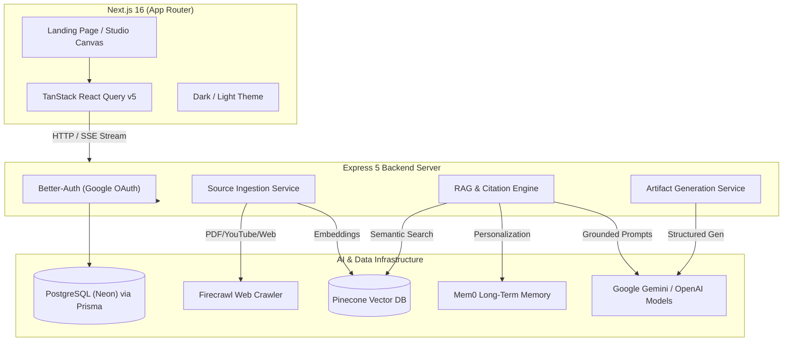

# 🧠 ExoMind — Turn Your Sources into Understanding

<p align="center">
  
  
  
  
  
  
  
  
</p>

---

## 🌟 Overview

**ExoMind** is a production-grade, source-grounded AI knowledge workspace and learning canvas inspired by Google NotebookLM. It allows researchers, students, developers, and professionals to ingest multi-modal source documents (PDFs, YouTube videos, web articles, and notes), chat with grounded citations, and transform raw knowledge into active study tools like **interactive flip flashcards**, **knowledge check quizzes**, **hierarchical mind maps**, and **executive summaries**.

---

## ✨ Key Features

### 📚 1. Multi-Modal Source Ingestion
- **📄 PDF Documents**: Upload research papers, reports, or slides with automatic semantic chunking, token counting, and Cloudinary asset hosting.
- **🌐 Web Content (Firecrawl)**: Crawl and scrape live website URLs, extracting clean markdown text for vector indexing.
- **🎥 YouTube Video Transcripts**: Paste any YouTube URL to automatically extract, chunk, and index full video transcripts.
- **📝 Markdown & Text Notes**: Add manual notes and custom thoughts directly into any workspace.

### 🎯 2. Source-Grounded RAG with Verifiable Citations
- **Sub-50ms Vector Search**: Vector embeddings stored and retrieved via **Pinecone**.
- **100% Grounded Context**: AI models answer strictly using retrieved source chunks to eliminate hallucinations.
- **Exact Inline Citations**: Follow citation tags `[1] (Page X, Chunk #Y)` to trace answers directly back to the original source passage.

### 🎨 3. Generative Learning Studio (Artifact Engine)
Transform uploaded source material with a single click into:
- 📇 **Study Flashcards**: Interactive 3D flip cards for active recall and concept mastery.
- ❓ **Knowledge Quizzes**: Multiple-choice quizzes with instant grading, explanations, and key takeaways.
- 🌳 **Visual Mind Maps**: Structured concept trees showing hierarchy and topical relationships.
- 📑 **Executive Summaries & Reports**: Deep research briefs formatted with markdown headings and insights.

### 🧠 4. Personalized Long-Term Memory (Mem0)
- Preserves user research goals, learning preferences, and background context across sessions.
- Automatically tailors the AI's explanation tone, depth, and communication style without altering workspace-specific grounded data.

### 🔒 5. Secure Authentication & Multi-Tenancy
- Powered by **Better-Auth** with **Google OAuth 2.0** and session management.
- Multi-workspace isolation backed by **PostgreSQL (Neon)** and **Prisma ORM**.

---

## 🏗️ System Architecture



---

## 🛠️ Tech Stack

### Frontend
- **Framework**: [Next.js 16](https://nextjs.org/) (App Router, Turbopack)
- **Library**: [React 19](https://react.dev/)
- **State & Data Fetching**: [TanStack React Query v5](https://tanstack.com/query)
- **Styling**: [Tailwind CSS v4](https://tailwindcss.com/)
- **Icons**: [Lucide React](https://lucide.dev/)
- **Animations & Effects**: `canvas-confetti`, `tw-animate-css`

### Backend
- **Runtime**: [Node.js](https://nodejs.org/) (ES Modules)
- **Framework**: [Express 5](https://expressjs.com/)
- **Database & ORM**: [PostgreSQL (Neon Serverless)](https://neon.tech/) with [Prisma ORM v7](https://www.prisma.io/)
- **Authentication**: [Better-Auth](https://www.better-auth.com/) (Google OAuth 2.0)
- **Asynchronous Tasks**: [Inngest](https://www.inngest.com/)
- **Vector Database**: [Pinecone](https://www.pinecone.io/)
- **AI SDK**: [Vercel AI SDK](https://sdk.vercel.ai/) (`@ai-sdk/google`, `@ai-sdk/openai`, `@google/generative-ai`)
- **Memory Engine**: [Mem0 AI](https://mem0.ai/)
- **Web Crawling**: [Firecrawl](https://www.firecrawl.dev/)
- **Search Grounding**: [Tavily AI](https://tavily.com/)
- **PDF Parser**: `unpdf`

---

## 🚀 Getting Started

### Prerequisites
- Node.js 18.x or higher
- npm or pnpm
- A Neon PostgreSQL Database URL
- A Pinecone API Key & Index
- Google AI (Gemini) API Key
- Google Cloud OAuth Credentials

---

### 1. Clone the Repository
```bash
git clone https://github.com/your-username/exomind.git
cd exomind
```

---

### 2. Backend Setup
```bash
cd server
npm install
```

Create a `.env` file in `server/.env`:
```env
PORT=3001
DATABASE_URL="your-postgresql-neon-pooler-url"
DIRECT_URL="your-postgresql-neon-direct-url"

BETTER_AUTH_SECRET="your-better-auth-secret"
BETTER_AUTH_URL=http://localhost:3001
CLIENT_URL=http://localhost:3005

GOOGLE_CLIENT_ID="your-google-client-id"
GOOGLE_CLIENT_SECRET="your-google-client-secret"

PINECONE_API_KEY="your-pinecone-api-key"
PINECONE_INDEX="notebook"

GEMINI_API_KEY="your-gemini-api-key"
MEM0_API_KEY="your-mem0-api-key"
FIRECRAWL_API_KEY="your-firecrawl-api-key"
TAVILY_API_KEY="your-tavily-api-key"

CLOUDINARY_CLOUD_NAME="your-cloud-name"
CLOUDINARY_API_KEY="your-cloudinary-api-key"
CLOUDINARY_API_SECRET="your-cloudinary-api-secret"
CLOUDINARY_UPLOAD_PRESET="your-preset"
```

Initialize Prisma Database:
```bash
npx prisma db push
```

Start the backend server:
```bash
npm run dev
```

---

### 3. Frontend Setup
```bash
cd ../client
npm install
```

Create a `.env.local` file in `client/.env.local`:
```env
PORT=3005
NEXT_PUBLIC_API_URL=http://localhost:3001
```

Start the Next.js dev server:
```bash
npm run dev
```

Open [http://localhost:3005](http://localhost:3005) in your browser.

---

## 📂 Project Structure

```text
exomind/
├── client/                     # Next.js 16 Frontend Application
│   ├── app/                    # App Router Pages
│   │   ├── page.jsx            # Main Landing & Showcase Page
│   │   ├── dashboard/          # Notebook Management Dashboard
│   │   ├── workspace/[id]/     # Interactive Research & Studio Canvas
│   │   └── layout.jsx          # Root Layout & Global Providers
│   ├── components/
│   │   ├── auth/               # Google OAuth & Auth Guard Modals
│   │   ├── dashboard/          # Workspace Cards & Creation Dialogs
│   │   ├── layout/             # Universal Sidebar & Header
│   │   ├── memory/             # Mem0 Personal Memory Bank Dialog
│   │   ├── ui/                 # Accessible UI Component Library
│   │   └── workspace/          # Chat, Sources & Learning Studio Viewers
│   ├── hooks/                  # TanStack Query Custom Hooks
│   └── lib/                    # API Clients, Constants & Helpers
│
└── server/                     # Express 5 Backend API Server
    ├── prisma/                 # Database Schema & Migrations
    └── src/
        ├── controllers/        # Express Route Handlers
        ├── lib/                # DB, Auth, Pinecone, Mem0 & RAG Pipeline
        ├── repository/         # Data Access Repositories
        ├── routes/             # REST Endpoints
        └── services/           # Ingestion, Artifact Gen & Query Services
```

---

## 📡 API Overview

| Method | Endpoint | Description |
| :--- | :--- | :--- |
| `GET` | `/api/workspaces` | List all notebooks for authenticated user |
| `POST` | `/api/workspaces` | Create a new research workspace |
| `GET` | `/api/sources?workspaceId=...` | List ingested sources for a notebook |
| `POST` | `/api/sources/upload` | Upload & chunk PDF documents |
| `POST` | `/api/sources/web` | Crawl web URL via Firecrawl |
| `POST` | `/api/sources/youtube` | Extract YouTube transcripts |
| `POST` | `/api/chat` | Query workspace with source-grounded RAG |
| `POST` | `/api/artifacts/generate` | Generate flashcards, quizzes, mind maps, summaries |
| `GET` | `/api/memories` | List user memories from Mem0 |

---

## 🤝 Contributing
Contributions are welcome! Please feel free to open a Pull Request or submit an issue.

---

## 📄 License
This project is licensed under the MIT License.
